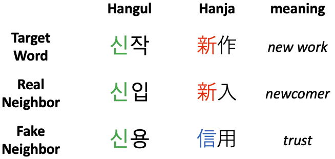

# Improving Korean NLP Tasks with Linguistically Informed Subword Tokenization and Sub-character Decomposition
- [arXiv link] TBA

## Author
Taehee Jeon

## Abstract
We investigate whether Transformer-based language models, trained solely on Hangul text, can learn the compositional morphology of Sino-Korean (SK) morphemes. Using BERTBASE and fastText, we conduct controlled experiments with target words and their “real” vs. “fake” neighbors—pairs that share a Hangul syllable representing the same SK morpheme vs. those that share only the Hangul syllable. Our results show that, while both models—especially BERT—distinguish real and fake pairs to some extent, performance is largely driven by the frequency of each experimental word rather than a true understanding of SK morphemes. These findings highlight limits of distributional learning for morpheme-level understanding and motivate explicit morphological modeling or Hanja-aware strategies for Korean. Dataset and code: <https://github.com/taeheejeon22/ko-skmorph-lm>.

# Dataset Overview
A compact corpus of Sino‑Korean (SK) two‑syllable words curated to test whether language models can recover morphemic meaning from Hangul alone. For each of 100 targets, we provide two neighbors: a **real** neighbor that shares the same SK morpheme in the first syllable and a **fake** neighbor that shares only the Hangul syllable (no SK morpheme match). The analysis‑ready CSV augments these pairs with similarity scores (BERT/fastText), Top‑K similar‑word counts/ratios (K=500/600), and frequency features used in Experiments 1–3.

# Source Dataset
- `data/dataset.xlsx` — Source dataset

## Schema

**File:** `data/dataset.xlsx` (Excel, Sheet: `Sheet1`)  
**Rows:** 100 targets (each with a real and a fake neighbor)

| Column | Type | Domain / Range | Description |
|---|---|---|---|
| `target_word` | str | Hangul | Target word (표제어). |
| `target_hanja` | str | Hanja | Hanja form of the target. |
| `morpheme_structure` | str | {`Bound + Bound`, `Bound + Free`} | SK morpheme structure of the **target**. |
| `target_headword` | str | Hangul | Target lemma/headword (often same as `target_word`). |
| `PoS` | str | e.g., `Noun` | Part of speech for the target. |
| `num_homographs` | int | 0–1 | Count of homographs for the **target**. |
| `real_neighbor` | str | Hangul | “Real” neighbor sharing the **same SK morpheme** in the first syllable. |
| `real_hanja` | str | Hanja | Hanja form of the real neighbor. |
| `real_neighbor_num_homographs` | int | 0–1 | Homograph count for the real neighbor. |
| `fake_neighbor` | str | Hangul | “Fake” neighbor sharing **only the Hangul syllable** (no SK morpheme match). |
| `fake_hanja` | str / null | Hanja or empty | Hanja form of the fake neighbor (often empty when not SK). |
| `fake_neighbor_num_homographs` | int | 0–1 | Homograph count for the fake neighbor. |
| `example_target` | str | serialized list | Example sentences for the **target** (stringified list of strings). |
| `example_real` | str | serialized list | Example sentences for the **real** neighbor. |
| `example_fake` | str | serialized list | Example sentences for the **fake** neighbor. |

### Notes
- `fake_hanja` is missing for some rows where the fake neighbor is **not** an SK word (21 blanks observed).
- Example fields are stored as **stringified lists** (e.g., `"[['…', '…']]"`)
- This Excel file is the **source** for the analysis-ready CSV; no model-derived metrics are included here.

# Analysis-ready File
- `data/dataset_for_experiments.csv` — Analysis‑ready CSV used in all experiments. Encoding: UTF‑8 (utf‑8‑sig).

## Schema
### Core identifiers
| Column | Type | Domain / Range | Description |
|---|---|---|---|
| `index` | int | 0–199 | Row index (provided in file). |
| `real_fake` | int | {1, 0} | 1 = Real pair (shared SK morpheme), 0 = fake pair. |
| `morpheme_structure` | str | {`Bound + Bound`, `Bound + Free`} | SK structure category of the **target**. |
| `PoS` | str | e.g., `명` | Part of speech for the **target**. |
| `num_homographs` | int | 0–1 | Count of target homographs. |

### Target / neighbor descriptors
| Column | Type | Domain / Range | Description |
|---|---|---|---|
| `target_word` | str | — | Target word (Hangul). |
| `target_hanja` | str | — | Target’s Hanja form. |
| `target_headword` | str | — | Lemma/headword of target. |
| `neighbor_word` | str | — | Neighbor word paired with target. |
| `neighbor_hanja` | str | — | Hanja form of the neighbor. |
| `neighbor_num_homographs` | int | ≥0 | Homograph count for neighbor. |

### Similarity & decision variables
| Column | Type | Domain / Range | Description |
|---|---|---|---|
| `cos_sim_neighbor_BERT` | float | [-1, 1] | Cosine similarity (BERT) between target and **designated neighbor**. |
| `cos_sim_neighbor_ft` | float | [-1, 1] | Cosine similarity (fastText) for the same pair. |
| `cos_sim_real-fake_BERT` | float | [-1, 1] | Cosine difference used in Exp. 1 (BERT). |
| `cos_sim_real-fake_ft` | float | [-1, 1] | Cosine difference used in Exp. 1 (fastText). |
| `correctness_BERT` | int | {0,1} | 1: BERT chose the **real** neighbor. |
| `correctness_ft` | int | {0,1} | 1: fastText chose the **real** neighbor. |

### Frequency features (raw / relative)
| Column | Type | Domain / Range | Description |
|---|---|---|---|
| `freq_BERT`, `freq_ft` | int | ≥0 | Token frequency of target in each model’s corpus proxy. |
| `freq_BERT_relative`, `freq_ft_relative` | float | ≥0 | Relative frequency of target (normalized). |
| `neighbor_freq_BERT`, `neighbor_freq_ft` | int | ≥0 | Token frequency of neighbor. |
| `neighbor_relative_freq_BERT`, `neighbor_relative_freq_ft` | float | ≥0 | Relative frequency of neighbor (normalized). |
| `real_neighbor_freq_token_BERT`, `real_neighbor_freq_token_ft` | int | ≥0 | Token frequency of **real** neighbor. |
| `freq_real_neighbor_token_BERT_relative`, `freq_real_neighbor_token_ft_relative` | float | ≥0 | Relative frequency of **real** neighbor. |

### Similar-words retrieval (Top-K = 500/600)
> Replace `*` with `BERT` or `ft`; replace `{K}` with `500` or `600`.

| Pattern | Type | Description |
|---|---|---|
| `num_sim_words_neighbor_*_n{K}` | int | Count of Top-N similar words that share **only Hangul** with the target. |
| `num_true_sim_words_neighbor_*_n{K}` | int | Count of Top-N similar words that share **both Hangul and Hanja**. |
| `num_true_sim_words_neighbor_*_n{K}_hanja` | int | Same as above, explicitly filtered by Hanja match. |
| `ratio_true_sim_words_neighbor_*_n{K}` | float | Proportion of true similar words among Top-N (0–1). |
| `ratio_true_sim_words_neighbor_*_n{K}_hanja` | float | Proportion (0–1) when restricted to Hanja match. |

### Examples & embeddings (for transparency; not needed to run stats)
| Column | Type | Description |
|---|---|---|
| `example_target`, `example_neighbor` | str | Example sentences for target / neighbor. |
| `example_target_tokenized_BERT`, `example_neighbor_tokenized_BERT` | str | Tokenized examples (BERT). |
| `vector_target_BERT`, `vector_target_ft` | str | Serialized embedding vector for target (diagnostic). |
| `vector_neighbor_BERT`, `vector_neighbor_ft` | str | Serialized embedding vector for neighbor (diagnostic). |
| `num_examples_target`, `num_examples_neighbor` | int | Number of example sentences used. |

## Environment
- Python 3.9–3.11
- See `requirements.txt`
- Tested on macOS 15.6.1

## Reproducing the Experiments
1. *(Recommended)* Create a virtual environment and install dependencies

2. Run `scripts/experiments.ipynb` from the repository root.
For example, in VS Code, set **Jupyter: Notebook File Root** to `${workspaceFolder}` in **Settings**, then restart the kernel.

# Citation
- TBA